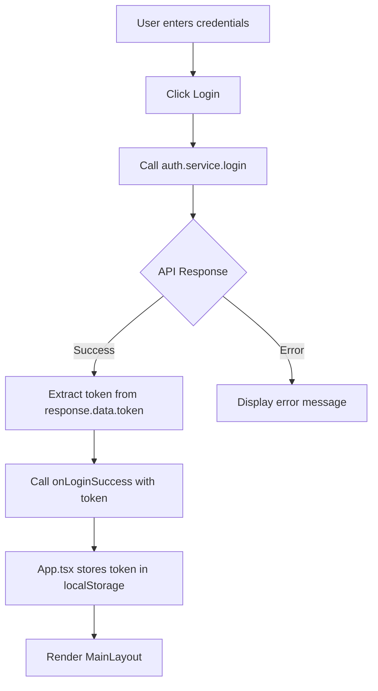

# Login Page Documentation

## Overview
The Login page is the entry point to the application. It handles user authentication and stores the JWT token for subsequent API requests.

## Location
`src/components/Login.tsx`

## Component Structure

```tsx
interface LoginProps {
  onLoginSuccess: (token: string) => void;
}

export const Login: React.FC<LoginProps>
```

## Features
- Username/password authentication
- Demo accounts display
- Error handling
- Loading states
- Professional styling with gradient background

## Authentication Flow



## API Integration

### Service Used
`src/services/auth.service.ts`

### Function
```typescript
login(username: string, password: string): Promise<LoginResponse>
```

### Request
```typescript
POST /api/auth/login
{
  "username": "manager",
  "password": "password123"
}
```

### Response
```typescript
{
  "success": true,
  "data": {
    "token": "eyJhbGciOiJIUzI1NiIsInR5cCI6IkpXVCJ9...",
    "user": {
      "userId": "uuid",
      "username": "manager",
      "role": "MANAGER"
    }
  },
  "message": "Login successful"
}
```

## State Management

```typescript
const [username, setUsername] = useState('');
const [password, setPassword] = useState('');
const [error, setError] = useState('');
const [loading, setLoading] = useState(false);
```

## Key Functions

### handleSubmit
```typescript
const handleSubmit = async (e: React.FormEvent) => {
  e.preventDefault();
  setError('');
  setLoading(true);

  try {
    const response = await login(username, password);
    if (response.success) {
      onLoginSuccess(response.data.token);
    }
  } catch (err: any) {
    setError(err.message || 'An error occurred');
  } finally {
    setLoading(false);
  }
};
```

## Styling

### Layout
- Centered container with max-width
- Gradient background
- White card with shadow

### Color Scheme
- Background: Blue gradient
- Card: White with shadow
- Primary button: Blue (`bg-blue-600`)
- Error text: Red (`text-red-600`)

### Responsive
- Full width on mobile
- Max-width 400px on desktop
- Padding adjusts based on screen size

## Demo Accounts Display

Shows available demo accounts for testing:
```tsx
<div className="mt-4 p-4 bg-blue-50 rounded-lg">
  <p className="text-sm text-gray-600 mb-2">Demo Accounts:</p>
  <ul className="text-xs text-gray-500">
    <li>Manager: manager / password123</li>
    <li>Doctor: doctor / password123</li>
    <li>Assistant: assistant / password123</li>
  </ul>
</div>
```

## Error Handling

- Network errors: "Failed to fetch"
- Invalid credentials: Backend error message
- Empty fields: HTML5 validation (required attribute)

## Testing

### Test Cases
1. **Valid Login**: Use `manager` / `password123`
2. **Invalid Credentials**: Use wrong password
3. **Empty Fields**: Try to submit without filling fields
4. **Network Error**: Stop backend server and try to login

### Expected Behavior
- Valid login → Redirect to Dashboard
- Invalid credentials → Show error message
- Empty fields → HTML5 validation prevents submit
- Network error → Show "Failed to fetch" error

## Integration with App.tsx

```tsx
// App.tsx
const [token, setToken] = useState<string | null>(
  localStorage.getItem('token')
);

const handleLoginSuccess = (newToken: string) => {
  setToken(newToken);
  localStorage.setItem('token', newToken);
};

return (
  <div>
    {token ? (
      <MainLayout token={token} onLogout={handleLogout} />
    ) : (
      <Login onLoginSuccess={handleLoginSuccess} />
    )}
  </div>
);
```

## Future Enhancements (for team members)

- [ ] Add "Remember Me" checkbox
- [ ] Add "Forgot Password" link
- [ ] Add password visibility toggle
- [ ] Add social login options
- [ ] Add loading spinner animation
- [ ] Add form validation feedback
