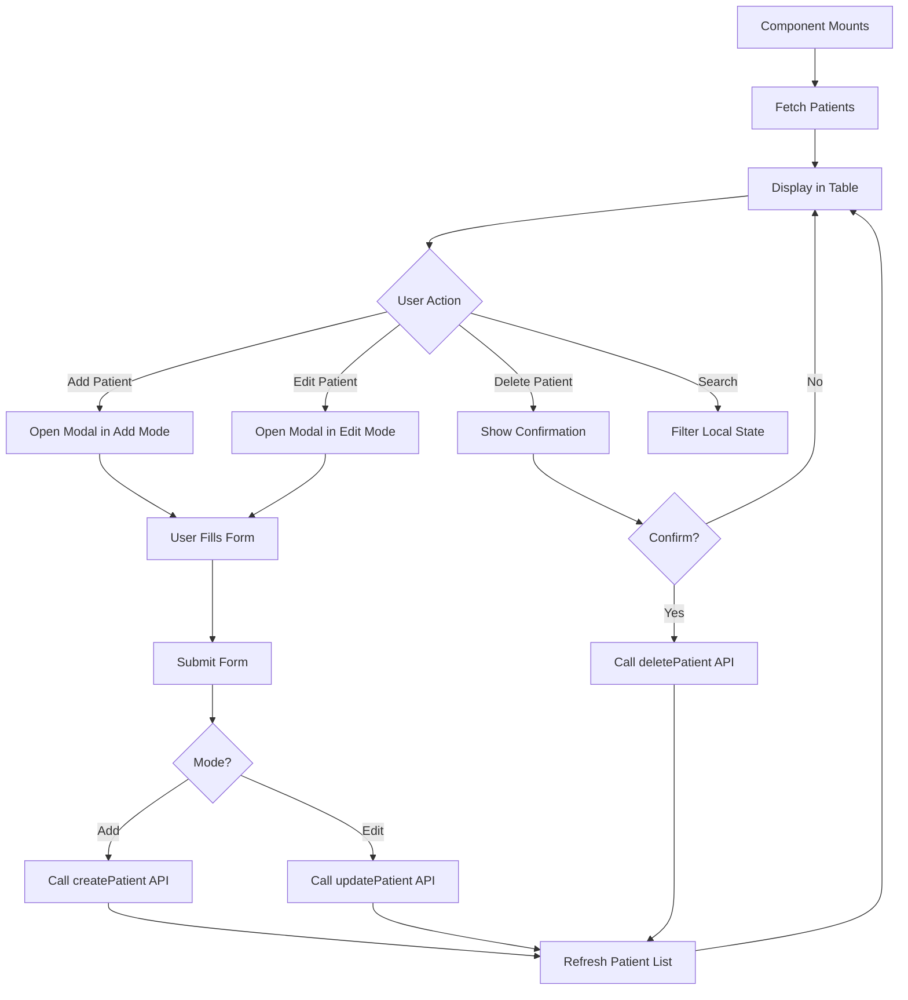

# Patients Page Documentation

## Overview
The Patients page is the most complex page in the application. It provides full CRUD (Create, Read, Update, Delete) operations for managing patient records.

## Location
`src/pages/PatientsPage.tsx`

## Component Structure

```tsx
interface PatientsPageProps {
  token: string;
}

export function PatientsPage({ token }: PatientsPageProps)
```

## Features
- **List all patients** in a table
- **Add new patient** via modal form
- **Edit existing patient** via modal form
- **Delete patient** with confirmation
- **Search patients** by name or email
- **Filter patients** (future enhancement)
- **Pagination** (future enhancement)

## API Integration

### Services Used
`src/services/patient.service.ts`

### Available Functions

#### Get All Patients
```typescript
getPatients(token: string): Promise<PatientResponse>
```

**Request:**
```typescript
GET /api/patients
Headers: { Authorization: 'Bearer <token>' }
```

**Response:**
```typescript
{
  "success": true,
  "data": [
    {
      "id": "uuid",
      "firstName": "John",
      "lastName": "Doe",
      "email": "john@example.com",
      "phone": "555-1234",
      "dateOfBirth": "1990-01-01",
      "gender": "Male",
      "address": "123 Main St",
      "emergencyContactName": "Jane Doe",
      "emergencyContactPhone": "555-5678",
      "medicalHistory": "None",
      "createdAt": "2025-01-01T00:00:00.000Z",
      "updatedAt": "2025-01-01T00:00:00.000Z"
    }
  ]
}
```

#### Create Patient
```typescript
createPatient(
  data: CreatePatientDTO, 
  token: string
): Promise<PatientResponse>
```

**Request:**
```typescript
POST /api/patients
Headers: { Authorization: 'Bearer <token>' }
Body: {
  "firstName": "John",
  "lastName": "Doe",
  "email": "john@example.com",
  "phone": "555-1234",
  "dateOfBirth": "1990-01-01",
  "gender": "Male",
  "address": "123 Main St",
  "emergencyContactName": "Jane Doe",
  "emergencyContactPhone": "555-5678",
  "medicalHistory": "None"
}
```

#### Update Patient
```typescript
updatePatient(
  id: string,
  data: UpdatePatientDTO,
  token: string
): Promise<PatientResponse>
```

**Request:**
```typescript
PUT /api/patients/:id
Headers: { Authorization: 'Bearer <token>' }
Body: { /* fields to update */ }
```

#### Delete Patient
```typescript
deletePatient(
  id: string,
  token: string
): Promise<void>
```

**Request:**
```typescript
DELETE /api/patients/:id
Headers: { Authorization: 'Bearer <token>' }
```

## State Management

```typescript
const [patients, setPatients] = useState<Patient[]>([]);
const [loading, setLoading] = useState(true);
const [error, setError] = useState('');
const [searchTerm, setSearchTerm] = useState('');

// Modal state
const [isModalOpen, setIsModalOpen] = useState(false);
const [modalMode, setModalMode] = useState<'add' | 'edit'>('add');
const [selectedPatient, setSelectedPatient] = useState<Patient | null>(null);

// Delete confirmation
const [deleteConfirmId, setDeleteConfirmId] = useState<string | null>(null);
```

## Component Architecture

### Main Component
`PatientsPage.tsx` - Orchestrates all functionality

### Sub-Components
- `PatientForm.tsx` - Reusable form for Add/Edit
- `Table` (from `ui/Table.tsx`) - Displays patient list
- `Modal` (from `ui/Modal.tsx`) - Wraps PatientForm
- `Button` (from `ui/Button.tsx`) - Actions

## Component Flow



## Key Functions

### fetchPatients
```typescript
useEffect(() => {
  const fetchData = async () => {
    try {
      const response = await getPatients(token);
      setPatients(response.data);
    } catch (error) {
      setError('Failed to load patients');
    } finally {
      setLoading(false);
    }
  };
  
  fetchData();
}, [token]);
```

### handleAddPatient
```typescript
const handleAddPatient = () => {
  setModalMode('add');
  setSelectedPatient(null);
  setIsModalOpen(true);
};
```

### handleEditPatient
```typescript
const handleEditPatient = (patient: Patient) => {
  setModalMode('edit');
  setSelectedPatient(patient);
  setIsModalOpen(true);
};
```

### handleDeletePatient
```typescript
const handleDeletePatient = async (id: string) => {
  try {
    await deletePatient(id, token);
    setPatients(prev => prev.filter(p => p.id !== id));
    setDeleteConfirmId(null);
  } catch (error) {
    setError('Failed to delete patient');
  }
};
```

### handleFormSubmit
```typescript
const handleFormSubmit = async (data: CreatePatientDTO) => {
  try {
    if (modalMode === 'add') {
      const response = await createPatient(data, token);
      setPatients(prev => [...prev, response.data]);
    } else {
      const response = await updatePatient(
        selectedPatient!.id,
        data,
        token
      );
      setPatients(prev =>
        prev.map(p => p.id === response.data.id ? response.data : p)
      );
    }
    setIsModalOpen(false);
  } catch (error) {
    setError('Failed to save patient');
  }
};
```

### filterPatients
```typescript
const filteredPatients = patients.filter(patient =>
  patient.firstName.toLowerCase().includes(searchTerm.toLowerCase()) ||
  patient.lastName.toLowerCase().includes(searchTerm.toLowerCase()) ||
  patient.email.toLowerCase().includes(searchTerm.toLowerCase())
);
```

## UI Layout

### Header Section
```tsx
<div className="flex justify-between items-center mb-6">
  <h1 className="text-2xl font-semibold">Patients</h1>
  <Button onClick={handleAddPatient}>
    <Plus className="w-4 h-4 mr-2" />
    Add Patient
  </Button>
</div>
```

### Search Bar
```tsx
<div className="mb-4">
  <Input
    type="text"
    placeholder="Search patients..."
    value={searchTerm}
    onChange={(e) => setSearchTerm(e.target.value)}
  />
</div>
```

### Patient Table
```tsx
<Table>
  <thead>
    <tr>
      <th>Name</th>
      <th>Email</th>
      <th>Phone</th>
      <th>Date of Birth</th>
      <th>Actions</th>
    </tr>
  </thead>
  <tbody>
    {filteredPatients.map(patient => (
      <tr key={patient.id}>
        <td>{patient.firstName} {patient.lastName}</td>
        <td>{patient.email}</td>
        <td>{patient.phone}</td>
        <td>{formatDate(patient.dateOfBirth)}</td>
        <td>
          <Button onClick={() => handleEditPatient(patient)}>
            Edit
          </Button>
          <Button onClick={() => setDeleteConfirmId(patient.id)}>
            Delete
          </Button>
        </td>
      </tr>
    ))}
  </tbody>
</Table>
```

### Modal with Form
```tsx
<Modal isOpen={isModalOpen} onClose={() => setIsModalOpen(false)}>
  <PatientForm
    mode={modalMode}
    initialData={selectedPatient}
    onSubmit={handleFormSubmit}
    onCancel={() => setIsModalOpen(false)}
  />
</Modal>
```

## PatientForm Component

### Location
`src/components/patients/PatientForm.tsx`

### Props
```typescript
interface PatientFormProps {
  mode: 'add' | 'edit';
  initialData?: Patient | null;
  onSubmit: (data: CreatePatientDTO) => void;
  onCancel: () => void;
}
```

### Form Fields
- First Name (required)
- Last Name (required)
- Email (required, email format)
- Phone (required)
- Date of Birth (required, date picker)
- Gender (required, select)
- Address (required)
- Emergency Contact Name (required)
- Emergency Contact Phone (required)
- Medical History (optional, textarea)

### Validation
```typescript
const validateForm = (): boolean => {
  if (!formData.firstName || !formData.lastName) {
    setError('Name fields are required');
    return false;
  }
  
  if (!isValidEmail(formData.email)) {
    setError('Invalid email format');
    return false;
  }
  
  // ... other validations
  
  return true;
};
```

## TypeScript Interfaces

### Patient
```typescript
// src/types/patient.ts
export interface Patient {
  id: string;
  firstName: string;
  lastName: string;
  email: string;
  phone: string;
  dateOfBirth: string;
  gender: string;
  address: string;
  emergencyContactName: string;
  emergencyContactPhone: string;
  medicalHistory: string;
  createdAt: string;
  updatedAt: string;
  registeredById: string;
}
```

### CreatePatientDTO
```typescript
export interface CreatePatientDTO {
  firstName: string;
  lastName: string;
  email: string;
  phone: string;
  dateOfBirth: string;
  gender: string;
  address: string;
  emergencyContactName: string;
  emergencyContactPhone: string;
  medicalHistory?: string;
}
```

### UpdatePatientDTO
```typescript
export interface UpdatePatientDTO {
  firstName?: string;
  lastName?: string;
  email?: string;
  phone?: string;
  dateOfBirth?: string;
  gender?: string;
  address?: string;
  emergencyContactName?: string;
  emergencyContactPhone?: string;
  medicalHistory?: string;
}
```

## Styling

### Color Scheme
- Add button: Blue (`bg-blue-600`)
- Edit button: Gray (`bg-gray-600`)
- Delete button: Red (`bg-red-600`)
- Table: Striped rows with hover effect

### Responsive Design
- Table scrolls horizontally on mobile
- Form fields stack on mobile
- Modal adjusts to screen size

## Error Handling

### Scenarios
1. **Failed to load patients**: Network error
2. **Failed to create patient**: Validation error or duplicate email
3. **Failed to update patient**: Validation error
4. **Failed to delete patient**: Patient has related records

### Display
```tsx
{error && (
  <div className="mb-4 p-4 bg-red-50 text-red-600 rounded-lg">
    {error}
    <button onClick={() => setError('')}>Dismiss</button>
  </div>
)}
```

## Testing

### Test Cases
1. **Load Patients**: Verify table displays all patients
2. **Add Patient**: Fill form and submit
3. **Edit Patient**: Click edit, modify fields, save
4. **Delete Patient**: Click delete, confirm
5. **Search**: Type in search box, verify filtering
6. **Validation**: Try to submit invalid data
7. **Cancel**: Open modal, click cancel

### Expected Behavior
- Patients load on mount
- Add creates new patient and updates table
- Edit updates patient and refreshes table
- Delete removes patient from table
- Search filters table in real-time
- Validation prevents invalid submissions
- Cancel closes modal without saving

## Performance Considerations

### Optimization Opportunities
- Debounce search input
- Pagination for large datasets
- Virtual scrolling for very large lists
- Memoize filtered results

## Future Enhancements (for team members)

- [ ] Add pagination
- [ ] Add sorting by column
- [ ] Add advanced filters (by gender, age range, etc.)
- [ ] Add bulk actions (delete multiple)
- [ ] Add export to CSV/PDF
- [ ] Add patient details view
- [ ] Add appointment history per patient
- [ ] Add treatment history per patient
- [ ] Add document upload
