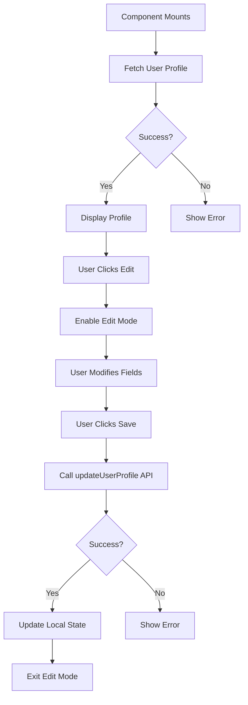

# Profile Page Documentation

## Overview
The Profile page displays the logged-in user's information and allows them to edit their profile details.

## Location
`src/pages/ProfilePage.tsx`

## Component Structure

```tsx
interface ProfilePageProps {
  token: string;
}

export function ProfilePage({ token }: ProfilePageProps)
```

## Features
- Display user profile information
- Edit profile functionality
- Save changes to backend
- Loading states
- Error handling

## User Profile Data

### Fields Displayed
- First Name
- Last Name
- Email
- Username
- Role (read-only)
- Phone (optional)
- Specialization (for doctors only)

## API Integration

### Services Used
`src/services/user.service.ts`

### Functions

#### Get User Profile
```typescript
getUserProfile(token: string): Promise<UserResponse>
```

**Request:**
```typescript
GET /api/users/:id
Headers: { Authorization: 'Bearer <token>' }
```

**Response:**
```typescript
{
  "success": true,
  "data": {
    "id": "uuid",
    "firstName": "Admin",
    "lastName": "Manager",
    "email": "manager@clinic.com",
    "username": "manager",
    "role": "MANAGER"
  }
}
```

#### Update User Profile
```typescript
updateUserProfile(
  userId: string, 
  data: UpdateUserDTO, 
  token: string
): Promise<UserResponse>
```

**Request:**
```typescript
PUT /api/users/:id
Headers: { Authorization: 'Bearer <token>' }
Body: {
  "firstName": "Updated",
  "lastName": "Name",
  "email": "updated@clinic.com"
}
```

## State Management

```typescript
const [user, setUser] = useState<User | null>(null);
const [isEditing, setIsEditing] = useState(false);
const [formData, setFormData] = useState<UpdateUserDTO>({});
const [loading, setLoading] = useState(true);
const [saving, setSaving] = useState(false);
const [error, setError] = useState('');
```

## Component Flow



## Key Functions

### fetchUserProfile
```typescript
useEffect(() => {
  const fetchProfile = async () => {
    try {
      const response = await getUserProfile(token);
      setUser(response.data);
      setFormData(response.data);
    } catch (error) {
      setError('Failed to load profile');
    } finally {
      setLoading(false);
    }
  };
  
  fetchProfile();
}, [token]);
```

### handleSave
```typescript
const handleSave = async () => {
  setSaving(true);
  try {
    const response = await updateUserProfile(
      user!.id, 
      formData, 
      token
    );
    setUser(response.data);
    setIsEditing(false);
  } catch (error) {
    setError('Failed to update profile');
  } finally {
    setSaving(false);
  }
};
```

### handleChange
```typescript
const handleChange = (e: React.ChangeEvent<HTMLInputElement>) => {
  setFormData(prev => ({
    ...prev,
    [e.target.name]: e.target.value
  }));
};
```

## UI Components Used

### From `components/ui/`
- `Button` - Edit, Save, Cancel buttons
- `Input` - Form fields

### Layout
```tsx
<div className="p-6">
  <div className="max-w-2xl mx-auto">
    <div className="bg-white rounded-lg shadow p-6">
      {/* Profile content */}
    </div>
  </div>
</div>
```

## Styling

### View Mode
- Read-only fields with gray background
- Edit button in top-right
- Clean card layout

### Edit Mode
- Editable input fields
- Save and Cancel buttons
- Validation feedback

### Color Scheme
- Background: White card on gray background
- Primary actions: Blue buttons
- Read-only fields: Gray background (`bg-gray-100`)

## TypeScript Interfaces

### User Interface
```typescript
// src/types/user.ts
export interface User {
  id: string;
  firstName: string;
  lastName: string;
  email: string;
  username: string;
  role: 'MANAGER' | 'DOCTOR' | 'ASSISTANT';
  phone?: string;
}
```

### Update DTO
```typescript
export interface UpdateUserDTO {
  firstName?: string;
  lastName?: string;
  email?: string;
  phone?: string;
}
```

## Validation

### Client-Side
- Email format validation
- Required fields check
- No empty strings

### Server-Side
- Unique email check
- Role-based permissions
- Data sanitization

## Error Handling

### Scenarios
1. **Failed to load profile**: Network error or invalid token
2. **Failed to update**: Validation error or duplicate email
3. **Unauthorized**: Token expired or invalid

### Display
```tsx
{error && (
  <div className="mb-4 p-4 bg-red-50 text-red-600 rounded-lg">
    {error}
  </div>
)}
```

## Testing

### Test Cases
1. **Load Profile**: Verify all fields display correctly
2. **Edit Profile**: Change name and save
3. **Cancel Edit**: Verify changes are discarded
4. **Invalid Email**: Try to save with invalid email format
5. **Network Error**: Stop backend and try to save

### Expected Behavior
- Profile loads on mount
- Edit mode enables input fields
- Save updates backend and local state
- Cancel discards changes
- Errors display appropriately

## Integration with MainLayout

```tsx
// MainLayout.tsx
case 'profile': 
  return <ProfilePage token={token} />;
```

## Future Enhancements (for team members)

- [ ] Add profile picture upload
- [ ] Add password change functionality
- [ ] Add two-factor authentication setup
- [ ] Add activity log
- [ ] Add notification preferences
- [ ] Add theme preferences (dark mode)
